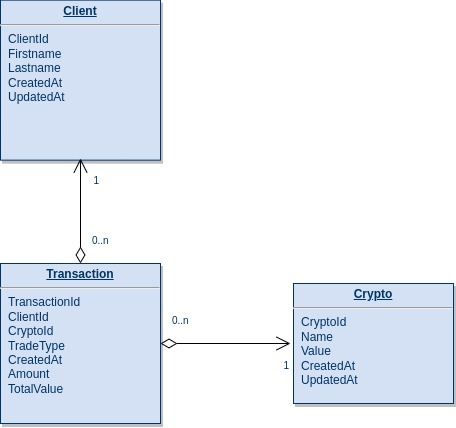

# hr-platform

### Technologies ###

* Java Spring Boot
* Graphql
* JPA - Hibernate
* Unit tests
* GraphQL SPQR

### Description ###

Java Spring Boot application (microservice) which is connected with
a postgres db in order to execute operations. In this project there are three tables, which can help us to 
run some graphql queries, in order to understand better the advantages of this communication way.
We use GraphQL SPQR to support Graphql in this project.GraphQL SPQR (GraphQL Schema Publisher & Query Resolver) is 
a simple-to-use library for rapid development of GraphQL APIs in Java.

### Specification ###

<li>Language : Java
<li>Framework : Spring boot, JPA, Hibernate
<li>Graphql
<li>Unit Tests
<li>Database storage : Postgres

### Installation ###

GraphQL SPQR is deployed to Maven Central.
```
<dependency>
    <groupId>io.leangen.graphql</groupId>
    <artifactId>spqr</artifactId>
    <version>0.12.0</version>
</dependency>
```

### Deploy external services ###

This project needs a postgres db. In order to deploy Postgres as a docker container:

* Go to root directory
* Run
  ```
  docker-compose up --build
  ```

### Important Links ###

The graphql ui link to run the queries is :
graphql: http://0.0.0.0:8091/gui

### Database schema ###




### Queries and Mutations examples ###

